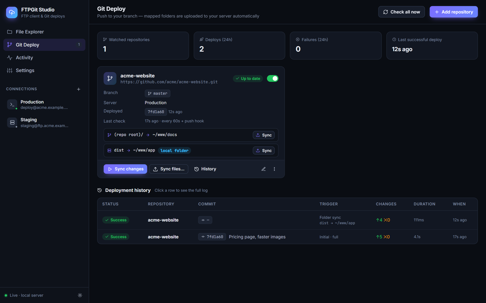
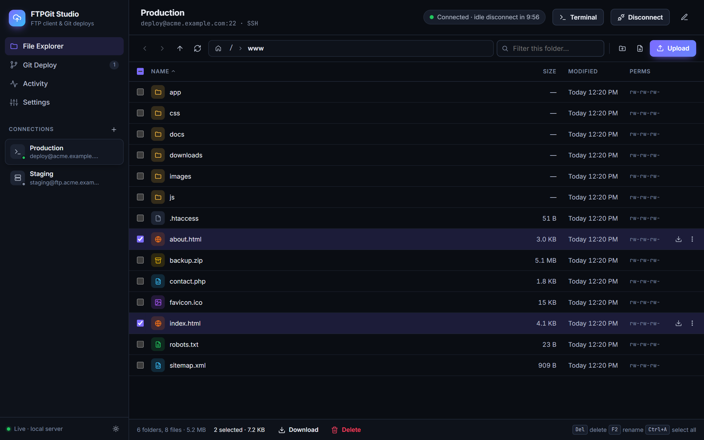
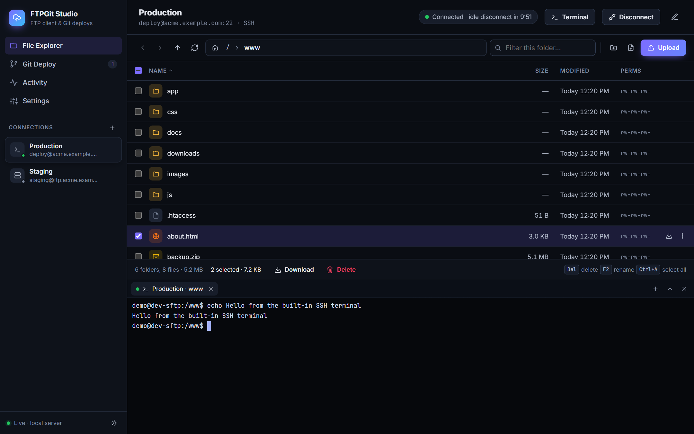
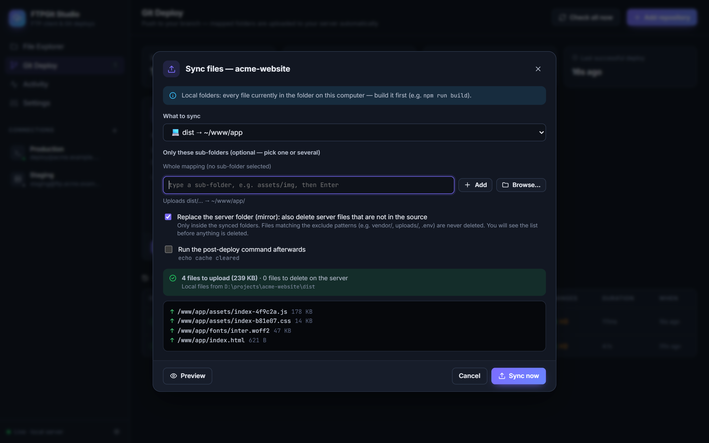
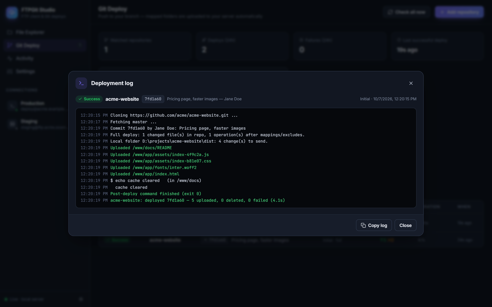
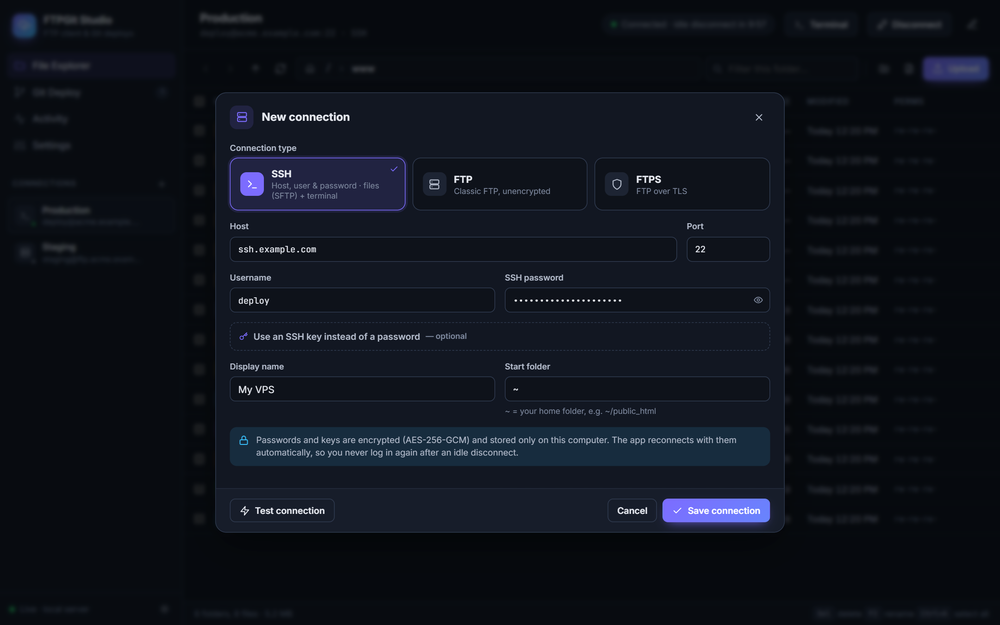
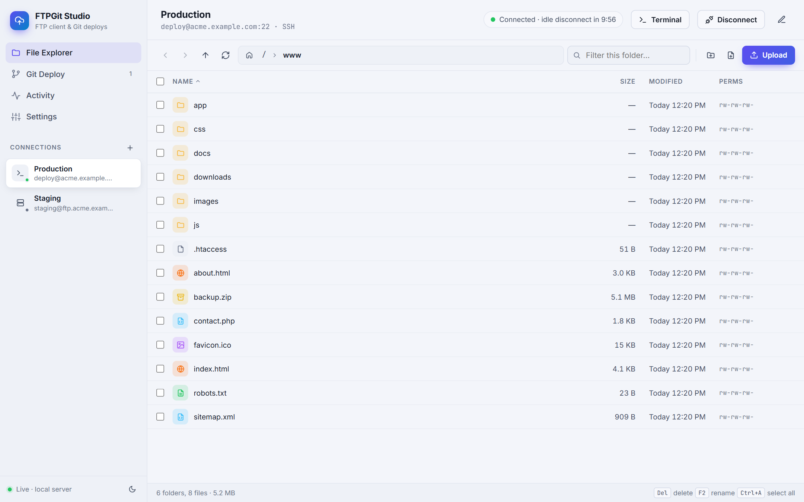
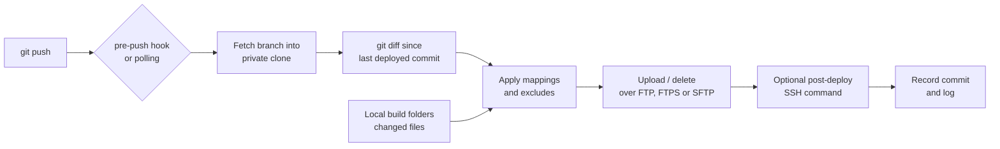

<div align="center">

# FTPGit Studio

**A modern, local file manager for FTP, FTPS and SSH servers, with Git push-to-deploy built in.**

Browse and edit your server files, open an SSH terminal, and ship your site whenever you `git push`.

[](LICENSE)




</div>

---

## Why FTPGit Studio?

Many websites still live on shared hosting or a small VPS, reached through FTP or SSH. Deploying usually means dragging files in an FTP client and hoping nothing was forgotten.

FTPGit Studio links your Git repository to your server instead:

- **You push, it deploys.** Only the files that changed are uploaded, and files you deleted are removed.
- **Build output too.** It can upload folders that are not in Git, such as a React/Vite `dist` folder.
- **One app for the server.** A file explorer, a text editor and an SSH terminal sit next to your deploys.
- **No account, no cloud.** Everything runs on your own computer. Your credentials never leave it.

## Table of contents

- [Features](#features)
- [Screenshots](#screenshots)
- [Quick start](#quick-start)
- [User guide](#user-guide)
- [How deploys work](#how-deploys-work)
- [Configuration](#configuration)
- [Security](#security)
- [Troubleshooting](#troubleshooting)
- [Development](#development)
- [Contributing](#contributing)
- [License](#license)

## Features

### 📁 File explorer for FTP, FTPS and SSH (SFTP)
- **Navigation:** breadcrumbs, back and forward, sortable columns (right-click the header to show or hide columns), a quick filter, and file-type icons.
- **Uploads:** drag and drop files or **whole folders**, including onto a sub-folder row. A transfers panel shows live progress.
- **Local pane:** show a folder of your computer next to the server, then upload or download by button or by dragging rows between the two panes.
- **File operations:** download, rename or move (also by dragging rows onto a folder), delete (recursive), new folder, new file, `chmod`, and copy path.
- **Editor:** a built-in text editor (`Ctrl+S` to save) for HTML, CSS, JS, PHP, `.htaccess` and more.
- **Keyboard shortcuts:** `Del`, `F2`, `Enter`, `Backspace`, `Ctrl+A`, `F5`, `Alt+←/→` and the arrow keys.
- **Command palette:** `Ctrl+K` opens any server, deploys any repository, or jumps to a path such as `~/www`.
- **Themes:** dark and light.

### 🖥️ SSH that just works
- **Login options:** password, pasted private key, key file (`~/.ssh/id_ed25519`, with an optional passphrase), or SSH agent.
- **Built-in terminal** (xterm.js): tabs, resizing, and *Open terminal here* on any folder.
- **Home folder:** `~` means your home folder everywhere. That matters on shared hosting, where `/` is not readable.
- **Host key check:** the server's key is trusted on first use, and you are warned if it ever changes.
- **Clear login errors:** you see which methods the server accepts, what was tried, and the likely fix.

### 🚀 Git push-to-deploy
- **Folder mappings** link a repo folder to a server folder, for example `dist → ~/public_html` or `api → ~/public_html/api`. Exclude patterns let you skip files.
- **Incremental deploys:** only changed files go up (`git diff`), and deleted files are removed on the server.
- **Instant or automatic:** a pre-push hook triggers the deploy within seconds of `git push`. Polling also catches pushes from CI or other machines.
- **Local-folder mappings** upload build output that is not in Git. Automatic deploys send only what changed.
- **Post-deploy SSH command**, for example `composer install --no-dev` or `php artisan migrate --force`. Its output appears in the deploy log.
- **Pipeline view:** each deploy shows its steps (Fetch, Plan, Upload, Post-deploy) with their status and duration. The log is grouped by step, with filters, search and a `.log` download.
- **Private repositories:** HTTPS with a token, SSH remotes, or your existing Git credential manager.

### 🎯 Manual uploads, under your control
- **Upload buttons:** upload one mapping, **one or several sub-folders**, or everything.
- **Preview first:** the dialog always lists every file and the total size, and the button then says exactly what happens, for example *Upload 4 files · 239 KB*.
- **Mirror mode** replaces a server folder with the source. You confirm the list first. Excluded files and other mappings are never touched.
- **Deployment history** keeps a full, live-streamed log of every run.

### 🛡️ Safety on production
- **Environment tags:** mark a connection as *Production*, *Staging* or *Development*. The tag shows in the sidebar, and its color runs along the top of the window while you browse that server.
- **Typed confirmation:** deleting files on a production server, or a mirror upload that deletes files, asks you to type the server or repository name first.
- **Activity center:** the bell icon lists running and recent deploys and transfers, and recent errors.

### 🔒 Sessions that respect your time
- **Encrypted credentials:** they are stored with AES-256-GCM, on your machine only.
- **Idle disconnect, silent reconnect:** after 10 minutes of inactivity (configurable) the connection closes, and the next click reconnects without asking for your password.
- **No dead connections:** a keep-alive runs while you work, and a dropped connection reconnects on its own.

## Screenshots

| File explorer | SSH terminal |
|---|---|
|  |  |
| **Upload folders (with preview)** | **Deployment log** |
|  |  |
| **New SSH connection** | **Light theme** |
|  |  |

## Quick start

### Requirements

- [Node.js](https://nodejs.org/) **18 or newer**
- [Git](https://git-scm.com/) available on your `PATH`. On Windows, Git for Windows also provides the `sh` and `curl` used by the push hook.

### Install and run

```bash
git clone https://github.com/<your-account>/ftpgit-studio.git
cd ftpgit-studio
npm install
npm start
```

The app opens at **http://127.0.0.1:4280**.

- **Windows:** you can double-click `start.bat` instead. It installs the dependencies on first run.
- **Without opening a browser:** run `npm run serve`.

### Try it without a real server

Two local test servers are included:

```bash
node test/dev-sftp.js
node test/dev-ftp.js
```

Run each command in its own terminal. Both use the username `demo` and the password `demo`:
- `dev-sftp.js` is an SSH/SFTP server on `127.0.0.1:2222`.
- `dev-ftp.js` is an FTP server on `127.0.0.1:2121`.

## User guide

### 1. Add a server

Click **+** next to *Connections* and choose the connection type:

| Type | Use it when you have… | Default port |
|---|---|---|
| **SSH** | an SSH/SFTP login, which is also what most VPS and many hosts provide | 22 |
| **FTP** | a plain FTP account | 21 |
| **FTPS** | FTP over TLS (explicit or implicit) | 21 / 990 |

- **Shortcut:** paste `user@host:port`, or a full URL such as `sftp://user@host:22/~/www`, into *Host*, and the fields fill themselves.
- **Check first:** click **Test connection**, then **Save**.
- **Start folder:** for SSH, `~` (your home folder) is the default start folder.
- **Environment:** tag the server as *Production* to get the red header and typed confirmations.

### 2. Manage files

Open a connection to browse it:
- **Upload:** drag files or folders from your desktop.
- **Edit:** double-click a text file.
- **More actions:** right-click anything.
- **Terminal (SSH only):** use the **Terminal** button.
- **Local pane:** click the split icon at the left of the toolbar to show a folder of your computer next to the server.
- **Connect / disconnect / edit:** use the **⋯** menu at the top right.

### 3. Connect a Git repository

Open **Deployments**, then **Add repository**:

1. **Repository:** enter your project folder (for example `D:\projects\my-site`) or a remote URL, then click **Inspect**. A local folder enables the instant push hook.
2. **Branch:** choose the branch to deploy (default `main`) and the target connection.
3. **Mappings:** add one per folder. For each, choose a source:
   - **Git**: a folder inside the repository. Its files come from the pushed commit.
   - **Local folder**: a folder on your computer, such as `frontend/dist`. Use it for build output that is not committed.

   Then set the server folder, for example `~/public_html`.
4. **Excludes:** add patterns such as `node_modules/`, `*.map`, `.env`, `uploads/`. Excluded files are never uploaded, and never deleted by mirror mode.
5. **First deploy:** choose whether to upload everything now, or start from the current commit and deploy only future pushes.

From now on, `git push origin main` deploys automatically.

### 4. Upload manually

Each mapping on the repository card has an **Upload** button, and **Upload folders…** covers every mapping:

1. **What to upload:** pick all mappings, one mapping, or one or several **sub-folders**. Tick them in the browser or type them.
2. **Mode:** *Update* uploads and overwrites; *Mirror* also deletes server files that are not in the source.
3. **Preview changes:** check exactly what will be uploaded, and deleted in mirror mode.
4. **Upload:** the button now states the result, for example *Upload 4 files · 239 KB, delete 2*. The deployment log opens and streams progress.

The other buttons on the card:
- **Deploy:** checks for new commits and uploads only what changed since the last deployed commit.
- **⋯ → Redeploy all files:** uploads everything again.

## How deploys work



- **Exact files:** the app deploys from its own private clone, so uncommitted work is never uploaded and files are transferred byte for byte.
- **Failed deploys:** the deployed commit does not advance, the full log is kept, and the next push (or **Deploy**) retries.
- **Rewritten history:** if a force-push rewrote the history, a full deploy runs instead.

More details on each behaviour are in [docs/DESIGN.md](docs/DESIGN.md).

## Configuration

### Settings in the app (Settings page)

| Setting | Default |
|---|---|
| Disconnect after inactivity | 10 minutes |
| Keep-alive interval while active | 60 seconds |
| Default polling interval for new repositories | 60 seconds |
| Theme | Dark |

### Environment variables

| Variable | Default | Purpose |
|---|---|---|
| `PORT` | `4280` | HTTP port of the local app |
| `HOST` | `127.0.0.1` | Interface to bind. Keep it local (see [Security](#security)). |
| `FTPGIT_DATA` | `./data` | Where connections, encrypted secrets, repository clones and logs are stored |

## Security

FTPGit Studio is a **single-user tool that runs on your own machine**.

- **Local only:** it listens on `127.0.0.1` and rejects requests whose `Host` header is foreign, which blocks DNS-rebinding attacks. Terminal WebSockets from other origins are rejected too.
- **Secrets stay encrypted:** passwords, private keys, passphrases and Git tokens are encrypted at rest with AES-256-GCM. They are never sent back to the browser.
- **Your data folder:** the key is `data/secret.key`. Treat the whole `data/` folder as sensitive: don't commit it (it is already in `.gitignore`), and back it up privately.
- **SSH host keys** are verified (trust on first use). A changed key blocks the connection until you approve it.
- **No authentication:** the app has no login of its own. **Don't expose it on a network** (`HOST=0.0.0.0`) unless you put it behind an authenticating proxy.

Found a vulnerability? Please open a private security advisory on the repository instead of a public issue.

## Troubleshooting

<details>
<summary><b>"Timed out" when connecting</b></summary>

- **Wrong connection type:** check the type matches the port. SSH usually uses 22, FTP uses 21. If they don't match, the app now says so explicitly.
- **Network:** make sure a firewall or VPN is not blocking the port.
</details>

<details>
<summary><b>"SSH login refused…"</b></summary>

The message lists the methods the server accepts and what was tried:
- **Password rejected:** click the 👁 button to check the password you typed.
- **Password not accepted at all:** if the server doesn't list `password`, use an SSH key.
- **One-time code:** servers that ask for a second factor need key-based login.
</details>

<details>
<summary><b>Connected, but the folder can't be listed</b></summary>

Over SSH, `/` is the whole server's root folder, and shared hosts often don't let you read it. Use `~` (your home folder) as the start folder, which is the default for new SSH connections. Use `~/…` for mapping targets.
</details>

<details>
<summary><b>"0 files to upload"</b></summary>

- **Build output:** for a folder that isn't committed, like `dist`, set the mapping source to **Local folder** and run your build first.
- **Git mappings:** they deploy the latest **pushed** commit, so local changes you haven't pushed are not included.
- **Excludes:** check your exclude patterns.
</details>

<details>
<summary><b>A yellow banner says to restart</b></summary>

The app's files were updated while it was running. Stop it (close the window or press `Ctrl+C`) and run `npm start` again.
</details>

<details>
<summary><b>"HOST KEY CHANGED"</b></summary>

The server presented a different SSH key than the one saved on the first connection:
- **Expected change:** after a reinstall or migration, choose **Trust new host key**.
- **Unexpected change:** contact your host before going further.
</details>

## Development

```text
server/
  index.js        HTTP API (incl. local-pane file access), static UI, startup migrations
  remote.js       protocol adapters: FTP/FTPS (basic-ftp) and SSH/SFTP (ssh2)
  ftpManager.js   sessions: queue, idle disconnect, keep-alive, auto-reconnect, host keys
  terminal.js     WebSocket ⇄ SSH shell bridge for the web terminal
  gitSync.js      polling, diff, mappings, local folders, scoped sync, mirror, deploy steps, push hook
  store.js        JSON store and AES-256-GCM secrets
  events.js       Server-Sent Events and activity log
public/           UI (vanilla JavaScript, no build step)
test/
  e2e.js          end-to-end test suite
  dev-ftp.js      local FTP server
  dev-sftp.js     local SSH/SFTP server (can emulate shared hosting, keyboard-interactive and OTP logins)
docs/             design notes and screenshots
```

### Run the tests

```bash
npm test
```

The end-to-end suite starts real FTP and SSH servers and a bare Git remote, then drives the HTTP API and the terminal WebSocket. It covers:
- file operations over FTP and SFTP;
- idle reconnect;
- SSH authentication and host keys;
- push-hook and polling deploys;
- local-folder mappings;
- scoped and mirror syncs;
- deploy steps, environment tags and local-pane transfers;
- security checks.

## Contributing

Issues and pull requests are welcome.

1. Fork the repository and create a branch.
2. Keep the existing code style: vanilla JS, no build step, small focused modules.
3. Add or update tests in `test/e2e.js`, and make sure `npm test` passes.
4. Open a pull request that describes the change and how you tested it.

## License

[MIT](LICENSE) — free to use, modify and distribute.
